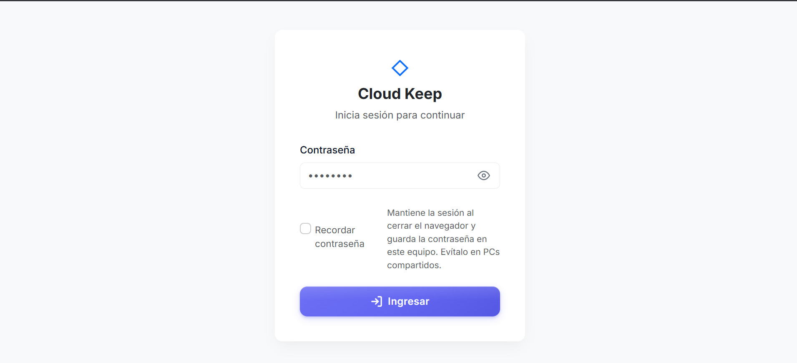
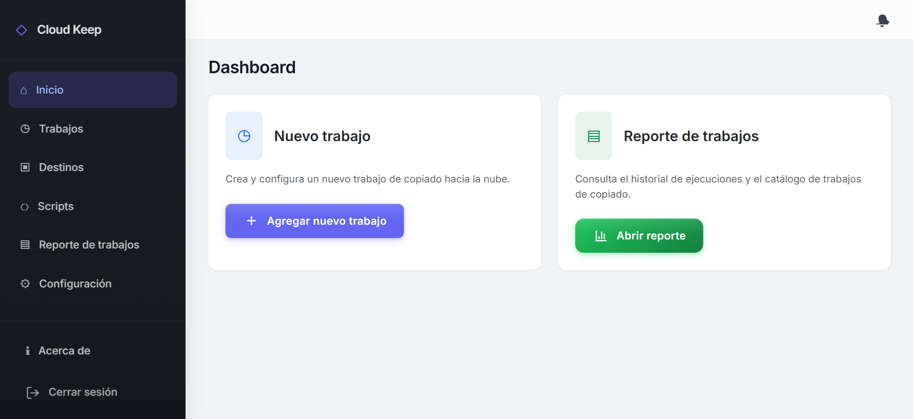
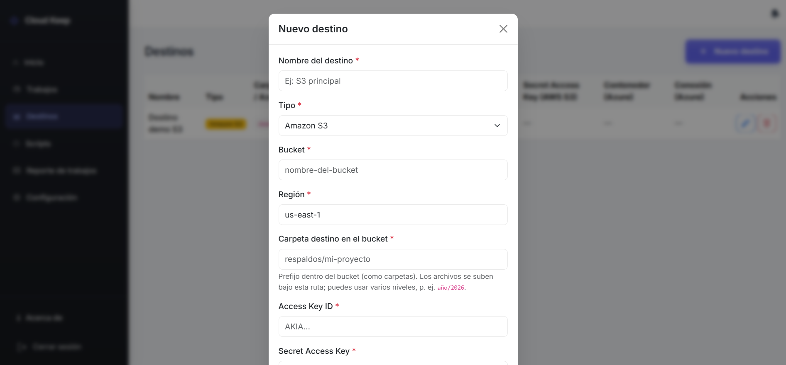
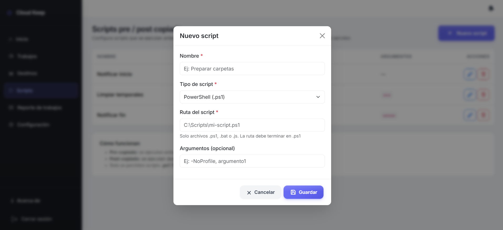
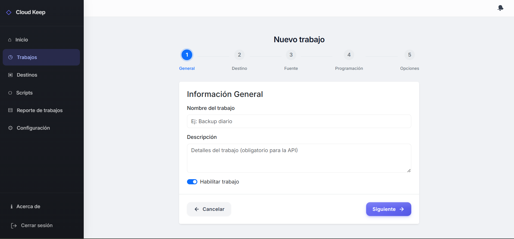
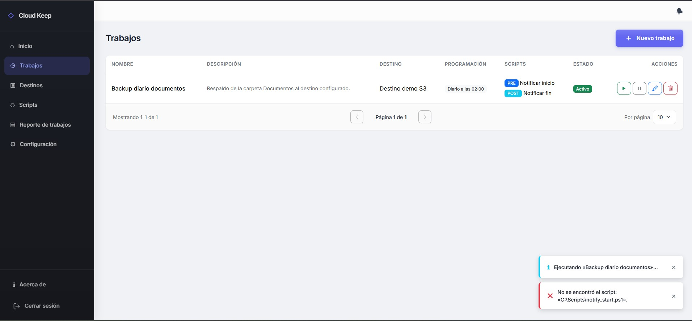
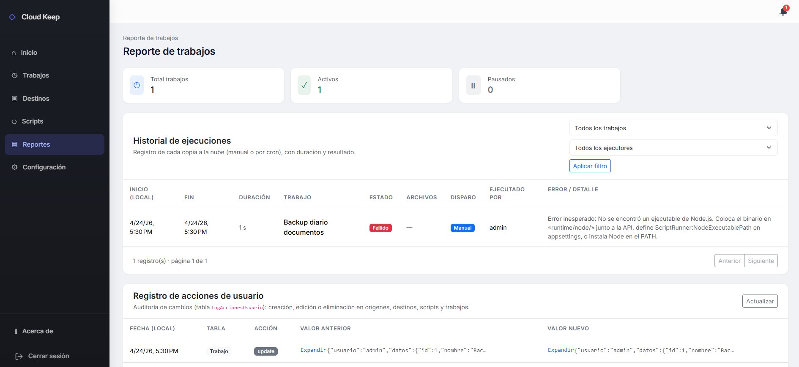
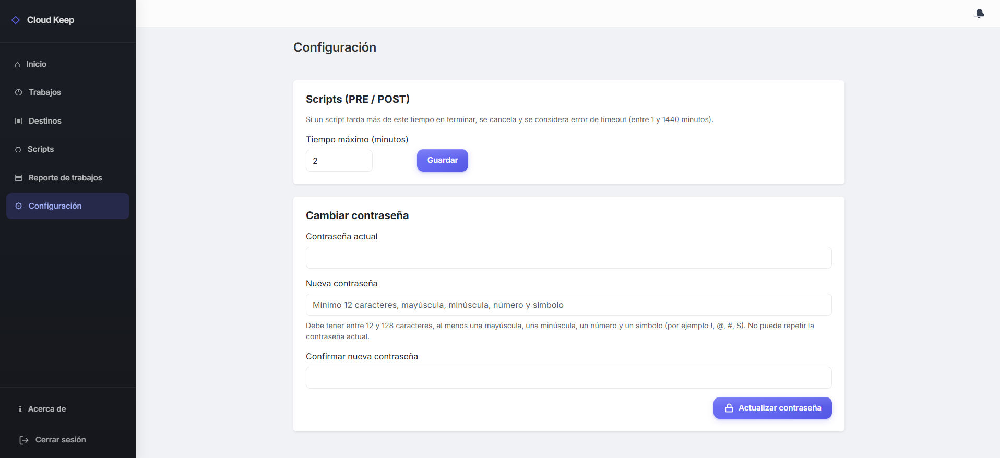

# Manual de Usuario - CloudKeep

> Version del manual: 1.1  
> Aplicacion: CloudKeep  
> Sistema operativo objetivo: Windows 11 o superior

---

## 1. Introduccion

CloudKeep es una aplicacion de escritorio para respaldar informacion hacia servicios en la nube, con soporte de ejecucion de scripts antes y despues del copiado.

La herramienta permite:
- Gestionar destinos de respaldo (AWS S3 y Azure Blob Storage).
- Configurar scripts `.ps1`, `.bat` y `.js`.
- Crear trabajos de respaldo manuales o programados.
- Aplicar filtros y exclusiones sobre los archivos.
- Consultar trazas y alertas de ejecucion.

---

## 2. Perfil de usuario

Este software esta orientado a un usuario administrador con conocimientos basicos o intermedios de TIC.

El usuario administrador puede:
- Configurar destinos.
- Vincular scripts.
- Crear y administrar trabajos.
- Ejecutar trabajos manualmente.
- Revisar reportes.
- Cambiar contrasena y timeout de scripts.

---

## 3. Requisitos para usar CloudKeep

### 3.1 Requisitos minimos recomendados
- Windows 11 o superior.
- CPU: Intel Core i3 (minimo) / i5 o Ryzen 5 (recomendado).
- RAM: 4 GB (minimo) / 8 GB (recomendado).
- Espacio en disco: 200 MB para instalacion (1 GB recomendado para operacion).
- Conexion a internet para conectarse a AWS o Azure.

### 3.2 Requisitos funcionales de entorno
- Credenciales validas de AWS S3 y/o Azure Blob Storage.
- Permisos de lectura sobre la carpeta origen.
- Permisos de salida a internet hacia APIs de AWS y Azure.

---

## 4. Acceso al sistema

Al iniciar CloudKeep, se presenta la pantalla de autenticacion.

1. Ingresar la contrasena del administrador(por defecto la contraseña es `admin`, por cambiarla tan pronto como sea posible).
2. Confirmar acceso.
3. Si la sesion es valida, se habilitan los modulos de administracion.

> Nota: la app puede mantener sesion activa segun la configuracion local.

### Pantalla de Login

---

## 5. Modulos funcionales
La aplicación tiene un dashboard principal el cual sirve de puente para navegar hacia los modulos de la aplicación.

### Dashboard principal

## 5.1 Modulo Destinos

Permite registrar y administrar ubicaciones de respaldo en la nube.

### Crear destino
1. Ir al modulo de destinos.
2. Seleccionar tipo de destino:
   - AWS S3
   - Azure Blob Storage
3. Completar datos obligatorios.
4. Probar conexion.
5. Guardar.

#### Datos para AWS S3
- Nombre del destino.
- Bucket name.
- Region del bucket.
- Carpeta o directorio en bucket.
- Access Key ID.
- Secret Access Key.

#### Datos para Azure Blob Storage
- Nombre del destino.
- Connection string.
- Nombre del contenedor Blob.
- Carpeta o directorio destino.

### Administrar destino
- Editar datos.
- Reprobar conexion.
- Eliminar destino (si no esta en uso por un trabajo).

### Modulo crear destino

---

## 5.2 Modulo Scripts

Permite vincular scripts para ejecutar acciones PRE y POST respaldo.

### Tipos soportados
- `.ps1` (ejecutado sobre el sistema operativo de la maquina CMD)
- `.bat` (ejecutado sobre el sistema operativo de la maquina CMD)
- `.js` (ejecutado con runtime Node.js 24 embebido)

### Vincular script
1. Ir al modulo scripts.
2. Registrar:
   - Nombre.
   - Ruta del script.
   - Argumentos (opcional).
3. Guardar.

### Administrar script
- Editar nombre, ruta y argumentos.
- Habilitar o deshabilitar.
- Eliminar script (si no esta asociado a trabajos).

### Modulo crear script

---

## 5.3 Modulo Trabajos

Es el modulo principal para definir como, cuando y hacia donde se copia la informacion.

### Crear trabajo (flujo recomendado)
1. Ir a **Trabajos > Nuevo trabajo**.
2. Definir:
   - Nombre.
   - Descripcion.
3. Definir origen:
   - Ruta de informacion a copiar.
4. Configurar filtros y exclusiones:
   - Exclusiones por patron (nombre/ruta).
   - Filtro por tamano minimo y/o maximo del archivo.
   - Filtro por fecha de creacion del archivo (desde/hasta).
   - Filtro por fecha de actualizacion del archivo (desde/hasta).
5. Asignar destino.
6. Definir programacion (cronograma).
7. Asociar scripts PRE y POST.
8. En script PRE, definir comportamiento en fallo:
   - Continuar.
   - Detener trabajo.
9. Guardar trabajo.

#### Filtros por archivo (nuevo en v1.1)
En el paso **Origen del respaldo** del wizard, CloudKeep permite filtrar que archivos se copian usando metadatos del archivo:

- **Tamano minimo (MiB)**: solo copia archivos con tamano mayor o igual al valor.
- **Tamano maximo (MiB)**: solo copia archivos con tamano menor o igual al valor.
- **Creacion del archivo (desde/hasta)**: compara contra la fecha de creacion del archivo.
- **Ultima modificacion (desde/hasta)**: compara contra la fecha de ultima actualizacion del archivo.

Reglas de funcionamiento:
- Todos los filtros son opcionales.
- Si dejas un campo vacio, ese limite no se aplica.
- Si defines varios filtros, el archivo debe cumplir **todos** para ser copiado.
- Los rangos son inclusivos.
- Si un rango es invalido (por ejemplo, `desde > hasta`), CloudKeep bloquea el guardado y muestra error.

> Nota tecnica: las fechas del formulario se capturan en hora local del equipo cliente y se comparan en UTC en el servidor donde se ejecuta la API.

### Administrar trabajo
- Editar configuracion.
- Habilitar o deshabilitar.
- Eliminar trabajo.
- Ejecutar manualmente.

### Wizard para crear nuevo trabajo

---

## 5.4 Ejecucion de trabajos

### Ejecucion manual
Desde la lista de trabajos, seleccionar **Ejecutar** para iniciar inmediatamente.

### Ejecucion programada
CloudKeep valida periodicamente si un trabajo debe ejecutarse segun su agenda.

Condiciones para ejecutar:
- Ya llego la fecha/hora programada.
- El trabajo esta activo.
- El trabajo no esta corriendo en ese momento.

Secuencia de ejecucion:
1. Script PRE (si existe).
2. Copiado de archivos origen con filtros.
3. Envio al destino configurado.
4. Script POST (si existe).
5. Registro de trazas y estado final.

Si por filtros no hay archivos que cumplan las condiciones, la ejecucion finaliza correctamente con mensaje informativo (0 archivos copiados).

### Modulo de trabajo y ejemplo de mensajes

---

## 5.5 Modulo Reportes y alertas

Permite revisar el historial operativo para seguimiento y auditoria.

Incluye:
- Estado de ejecuciones (completado, fallido, etc.).
- Numero de archivos copiados.
- Errores de scripts o de conectividad.
- Alertas del sistema.

> Las trazas funcionales se almacenan y muestran para consulta historica (segun configuracion del sistema).

### Modulo de Reportes

---

## 5.6 Modulo Configuracion

Permite gestionar parametros globales de la aplicacion:
- Timeout de scripts.
- Cambio de contrasena de administrador.

### Buenas practicas
- Usar timeout acorde al tiempo real esperado de tus scripts.
- Cambiar contrasena periodicamente.
- Validar scripts en entorno controlado antes de productivo.

### Modulo de configuraciones

---

## 6. Comportamiento en errores frecuentes

### 6.1 Falla de autenticacion
- Verifica contrasena.
- Si cambiaste la contrasena recientemente, usa la mas actual.

### 6.2 Falla de conexion a destino
- Revisar credenciales.
- Confirmar bucket/contenedor y region.
- Validar acceso a internet y firewall/proxy.

### 6.3 Falla al ejecutar script
- Verificar ruta del script.
- Verificar permisos de ejecucion del SO.
- Revisar argumentos enviados.
- Validar compatibilidad de runtime para `.js`.

### 6.4 Trabajo no se ejecuta en horario
- Confirmar que el trabajo este activo.
- Revisar programacion.
- Verificar que no este ya en estado de ejecucion.
- Consultar trazas para diagnostico.

### 6.5 Filtros de copia no devuelven archivos
- Verificar que el tamano minimo no sea mayor al tamano maximo.
- Validar que la fecha "desde" no sea posterior a la fecha "hasta".
- Revisar si los rangos de fecha/tamano son demasiado restrictivos.
- Ejecutar una prueba manual sin filtros para comparar resultados.

---

## 7. Alcance funcional y limites

### Incluye
- Respaldo hacia AWS S3 y Azure Blob Storage.
- Scripts PRE y POST (`.ps1`, `.bat`, `.js`).
- Programacion de trabajos.
- Reportes y alertas.

### No incluye
- Almacenamiento propio en la nube.
- Copia en tiempo real.
- Scripts durante el copiado (solo PRE/POST).
- Gestion de multiples usuarios, roles o permisos avanzados.
- Integraciones nativas con otros proveedores fuera de S3/Azure.

---

## 8. Recomendaciones de uso en produccion

- Crear trabajos por tipo de informacion (documentos, logs, reportes, etc.).
- Probar primero ejecucion manual antes de activar programacion.
- Definir filtros para evitar copiar archivos temporales innecesarios.
- Mantener credenciales seguras y rotarlas segun politica interna.
- Revisar reportes diariamente al inicio de la operacion.

---

## 9. Checklist de puesta en marcha

- [ ] Instalacion completada.
- [ ] Acceso con usuario administrador validado.
- [ ] Destino AWS y/o Azure creado y probado.
- [ ] Scripts requeridos vinculados y testeados.
- [ ] Trabajo de respaldo creado.
- [ ] Filtros por archivo (tamano/fechas) validados segun necesidad.
- [ ] Primera ejecucion manual exitosa.
- [ ] Programacion activada.
- [ ] Verificacion de trazas y alertas.

